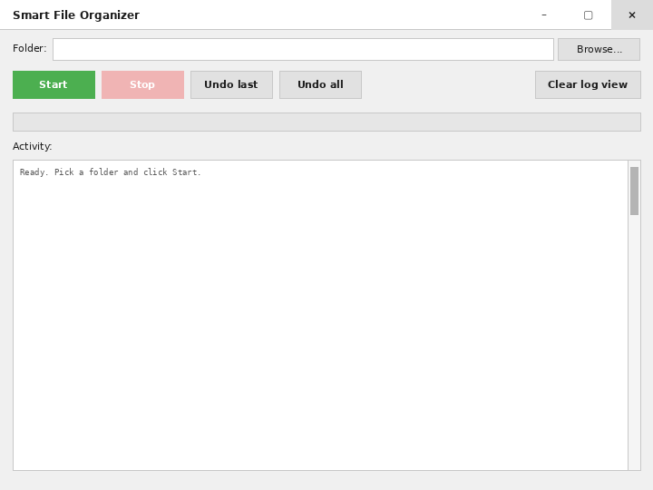
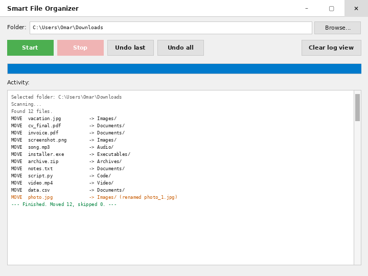
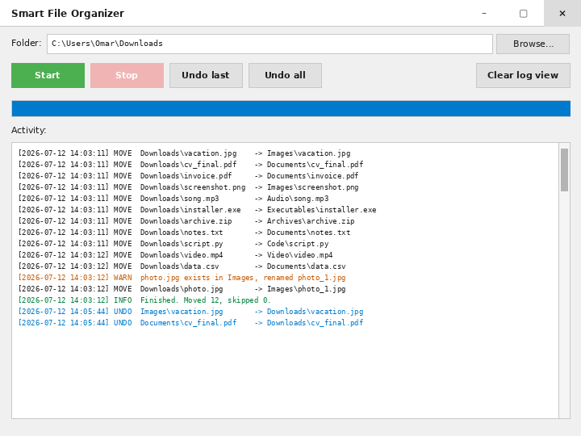

# Smart File Organizer

Small Python app that cleans up a messy folder by moving files into subfolders based on their type. Images end up in Images, PDFs in Documents, mp3s in Audio, and so on.

## Running it

You need Python 3.8 or newer. Everything the code uses is in the standard library so there is nothing to `pip install`. On Linux you might need `sudo apt install python3-tk` if tkinter is not already there.

```
git clone https://github.com/tsarumar/Smart-File-Organizer.git
cd Smart-File-Organizer
python main.py
```

The window opens, you pick a folder with Browse, hit Start, and watch the log fill up. If you don't like the result, Undo last or Undo all puts everything back.

## Screenshots

Empty window:



After a run on a folder with a mix of files:



The log it keeps in `organizer.log`:



## How the code is split

Each class has one job.

- `classifier.py` decides which category a file belongs to, based on its extension.
- `logger.py` writes moves to `organizer.log` with timestamps.
- `history.py` records every move to `history.json` so undo works.
- `organizer.py` glues them together and does the actual moving with `shutil.move`.
- `gui.py` is the tkinter window.
- `main.py` opens the window.

Extensions get grouped into Images, Documents, Audio, Video, Archives, Code, Executables and Fonts. Anything not in those lists ends up in Other. You can also add rules at runtime with `FileClassifier.add_rule()`.

## About errors

If a file with the same name already exists at the destination the new one gets `_1`, `_2`, etc. appended so nothing gets overwritten. Permission errors and other OS errors get caught, logged, and skipped, so one weird file cannot stop the whole run.

The GUI runs the work in a background thread. Without that the window would freeze while files move. Stop uses the same idea: the button flips a flag the worker checks between files.
